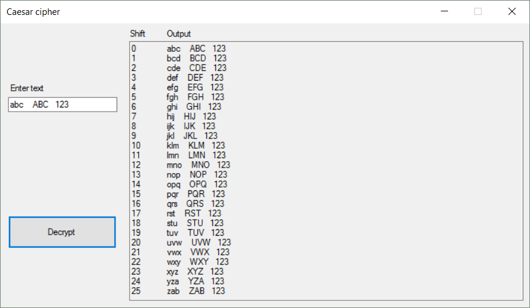
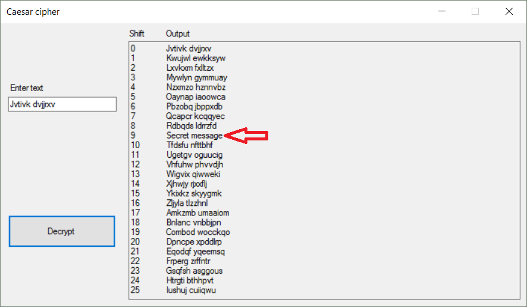

Caesar cipher
===================

A simple program written in C# to encrypt and decrypt caesar cipher.

More about this encryption technique:
https://en.wikipedia.org/wiki/Caesar_cipher

----------

Screenshots
-------------
\#1

\#2

